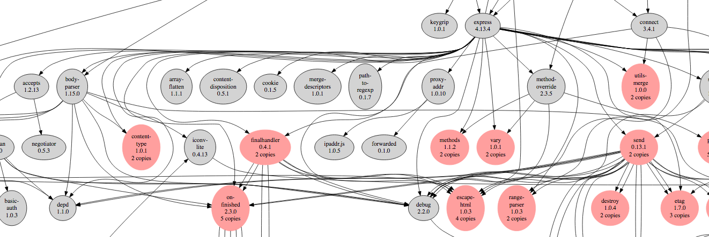
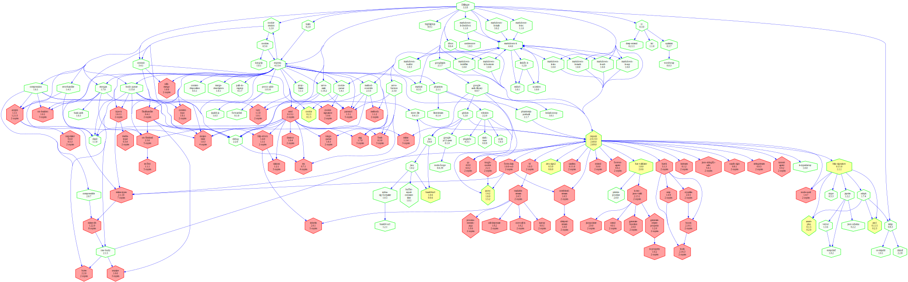

ns-package-graph - visualize packages used in an N|Solid runtime
================================================================================

usage
================================================================================

    ns-package-graph [app or instance id]

When run with no arguments, displays some help and a list of running N|Solid
applications, and their instances.

    $ ns-package-graph

    specify either an app name or id as an argument

    for more information, see: https://github.com/pmuellr/ns-package-graph

    apps:
       nsolid-proxy
       nsolid-console

    ids:
       2a2fa7bcabb9e643ac2b2658ffb5ee9886812790  (app: nsolid-proxy)
       5eefaa53586d3f9a68aa54a39097d9bcd24d6ca5  (app: nsolid-console)

When you pass an app or instance id as parameter, a matching instance will
be sent the `nsolid-cli package_info` command, to capture information on the
process's packages and modules.  That information is used to generate a
[GraphViz][] [dot][] formatted graph diagram of package dependencies in the
running program.  That output is then passed to the awesome [Viz.js][] library
to convert into SVG, which is then written to stdout.

    $ ns-package-graph Dillinger

    <?xml version="1.0" encoding="UTF-8" standalone="no"?>
    <!DOCTYPE svg PUBLIC "-//W3C//DTD SVG 1.1//EN"
     "http://www.w3.org/Graphics/SVG/1.1/DTD/svg11.dtd">
    <!-- Generated by graphviz version 2.38.0 (20140413.2041)
     -->
    ...

    $ ns-package-graph Dillinger > ~/tmp/Dillinger.svg

For example, here's the output from an old version of [Dillinger][]:

[images/Dillinger.svg](images/Dillinger.svg)

[GraphViz]: http://www.graphviz.org/
[dot]: http://www.graphviz.org/pdf/dotguide.pdf
[Viz.js]: http://mdaines.github.io/viz.js/
[Dillinger]: http://dillinger.io/

install
================================================================================

To install the `ns-package-graph` utility globally, run:

    npm install -g https://github.com/pmuellr/ns-package-graph.git

Note that you will to have N|Solid installed and running.  Specifically, this
utility will make calls into `nsolid-cli` to get information from the same
hub as your N|Solid runtime processes.

For more information on installing N|Solid, see:

* https://docs.nodesource.com/nsolid/1.4/docs/quickstart

trouble shooting
================================================================================

The following sort of message will be displayed if the `nsolid-cli` command is
not installed.  Refer to the N|Solid installation instructions above.

    $ ns-package-graph

    error running `nsolid-cli info`: Command failed: nsolid-cli  info
    /bin/sh: nsolid-cli: command not found

For other `nsolid-cli` related errors, see the help information for that
command, by running:

    $ nsolid-cli --help

Eg, if you aren't running the N|Solid hub on the default ports, you can override
the defaults by creating a `~/.nsolid-clirc` file.

contributing
================================================================================

See the documents [CONTRIBUTING.md](CONTRIBUTING.md) and
[CODE_OF_CONDUCT.md](CODE_OF_CONDUCT.md).
